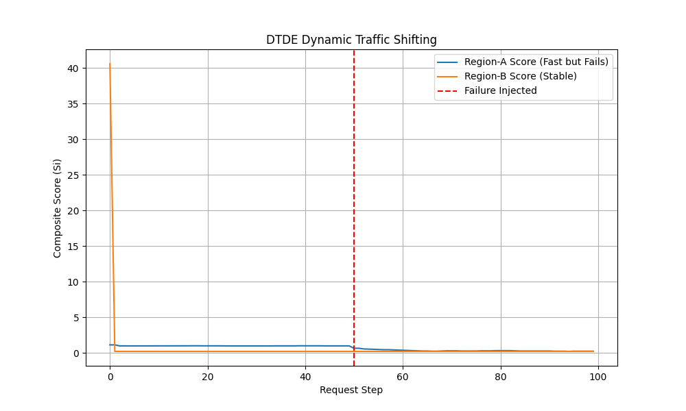

# Dynamic Traffic Decision Engine (DTDE) Lab

This repository implements a **Dynamic Traffic Decision Engine** designed to optimize multi-cloud/multi-region traffic routing through a composite scoring algorithm.

##  Visualizing the Traffic Shift

*Figure 1: The engine detects a failure in Region-A at step 50, causing its score to plummet. The engine then prioritizes the stable Region-B.*

##  The Core Algorithm
The engine calculates a health score ($S_i$) for each backend using the following weighted logic:

$$S_i = (w_h \cdot H_i) + (w_l \cdot \frac{1}{L_i + 1}) + (w_s \cdot S_i)$$

Where:
* **$H_i$**: Health score (success rate over a sliding window).
* **$L_i$**: Observed latency (P95).
* **$S_i$**: Security/Policy status.

##  Simulation Results
| Phase | Winning Region | Status | Score |
| :--- | :--- | :--- | :--- |
| **Healthy** | Region-A | PASS | ~1.00 |
| **Failure Start** | Region-A | **FAIL** | < 0.60 |
| **Recovery** | **Region-B** | PASS | ~0.80 |

##  Project Structure
* `dtde/models.py`: Data structures for backend telemetry.
* `dtde/telemetry.py`: Sliding window implementation using NumPy.
* `dtde/decision.py`: The scoring engine and selection logic.
* `experiments/visualize_results.py`: Generates the performance graph.

##  Getting Started
1. Install dependencies: `pip install -r requirements.txt`
2. Generate the graph: `python -m experiments.visualize_results`
3. Run CLI simulation: `python -m experiments.run_experiment_baseline_vs_dtde`
